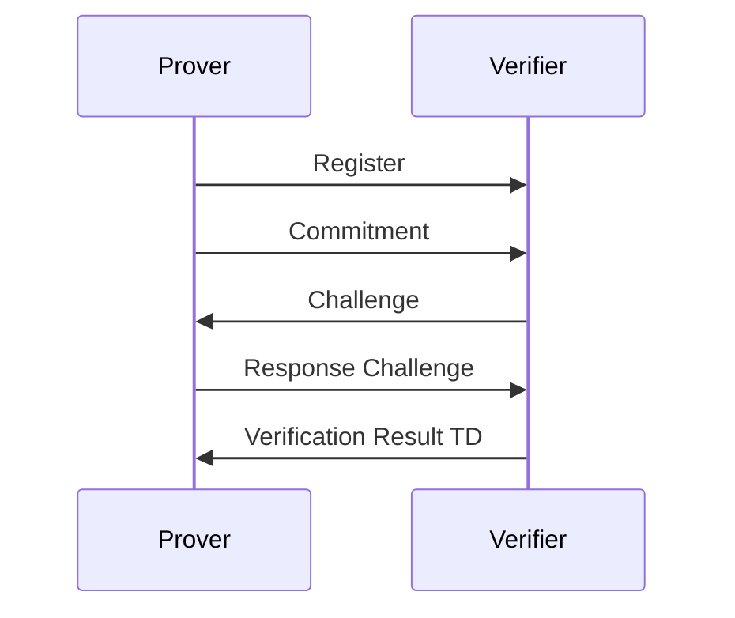

# Chaum-Pedersen Zero-Knowledge Protocol Implementation

This project is an implementation of the [Chaum-Pedersen](https://www.cs.umd.edu/~waa/414-F11/IntroToCrypto.pdf) - page 377 section "3. Sigma Protocols"
subsection "3.2. Chaum–Pedersen Protocol." - Zero-Knowledge protocol for authentication.

## Table of Contents
- [Preliminaries](#preliminaries)
- [Building the Project](#building-the-project)
- [Running the Program](#running-the-program)
- [Testing the Program](#testing-the-program)
- [Design Documentation](#design-documentation)
    - [Design Principles](#design-principles)
    - [Modules](#modules)
    - [Diagrams](#diagrams)
    - [Error Handling](#error-handling)
- [Future Work](#future-work)

---

## Preliminaries

There are 2 options for building this project:

1. You can build and run it directly with `Cargo`.
2. Alternatively, you can build and run it using `Docker`.

### Rust requirements

- You will need `cargo 1.78+`.
- Also, make sure you have `rustc 1.78+`.

### Docker requirements

- Ensure you have both the Docker Server and Client version 26+ installed.

---

## Building the Project

To build the project, run the following commands:

### Building with Rust

```shell
> cargo build
```

### Building with Docker

```shell
> docker compose build
```

---
## Running the Program

### Running with Rust

1. Generate Material for params `p`, `q`, `g` and `h`.

```shell
> cd protocol
> cargo run -- -u john
```
By default this will leave 2 files, one for the server in `protocol/data/server_material.json` and one for the client in `protocol/data/client_material.json`.

For more information about parameters run `cargo run -- --help`.

2. Start the Verifier

```shell
> cd verifier
> RUST_LOG=info cargo run -- -c config/default.toml
```

- `verifier/config/default.toml`: Contains configuration about how to run the server.

3. Run the Prover with some `x`

```shell
> cd prover
> RUST_LOG=info cargo run -- -p http://localhost:50000 -u john -m ../protocol/data/client_material.json -x 42
```
For more information about parameters run `carog run -- --help`.

- By default `-p` and `-m` are provided with the values in the example.

### Running with Docker Compose

1. Generate material and run server verifier

```shell
> docker compose up
```

2. Run Prover against server

```shell
> cd prover
> RUST_LOG=info cargo run -- -p http://localhost:50000 -u docker_user -m ../protocol/data/client_material.json -x 42
```
For more information about parameters run `carog run -- --help`.

- By default `-p` and `-m` are provided with the values in the example.

> NOTE: `u` param can be changed but for that you will need to edit `docker-compose.yml` file in line 15.

---

## Testing the program

```shell
> cargo test
```

---

## Design Documentation
In this section, It will described all the assumptions, decisions, and pending improvements of SOTA of this project.

### Design Principles
Domain-Driven Design (DDD) is a software development approach that emphasizes the importance of understanding and modeling the domain of the problem at hand. It encourages collaboration between domain experts and developers to create software that closely aligns with the real-world problem domain. By following DDD principles, developers can create more maintainable, extensible, and robust software systems.

### Modules
#### Protocol
The `protocol` module is a library that implements the Chaum-Pedersen protocol using a [Type-State Pattern](https://cliffle.com/blog/rust-typestate/) to control the flow of the protocol. This implementation uses pure functions, which enable testability, composability, and extensibility. The `protocol` module also includes a small binary that generates material parameters and saves them into a file using a random generator BigInt, while preserving the properties of the problem. This approach eliminates the need for manual parameter setup.

#### Verifier
The `verifier` module implements a gRPC server for the [Protobuf definition](./protos/zk_auth.proto), utilizing the `protocol` module to solve the authentication process. It follows a [Domain-Driven Design (DDD)](https://www.domainlanguage.com/ddd/) approach. DDD is a software development methodology that focuses on aligning software design with the domain model, enabling better communication and collaboration between domain experts and developers.

#### Prover
The `prover` module is a client that interacts with the `verifier` module using the `protocol` module to authenticate against it.

### Diagrams

#### Protocol Type-State Pattern


### Error Handling

All error handling are based on `anyhow` since the main code is a gRPC server (a.k.a. `verifier`) and we need to convert all errors back to `tonic::Status`.
In `protocol` it could have been used `thiserror` but since there are any `unwrap` present and everything is handle in terms of Type-State pattern, there was no need to return errors.


---

## Future Work

- Implements observability.
- Implements automated integration tests
- Implements CD pipeline and automated deployment


